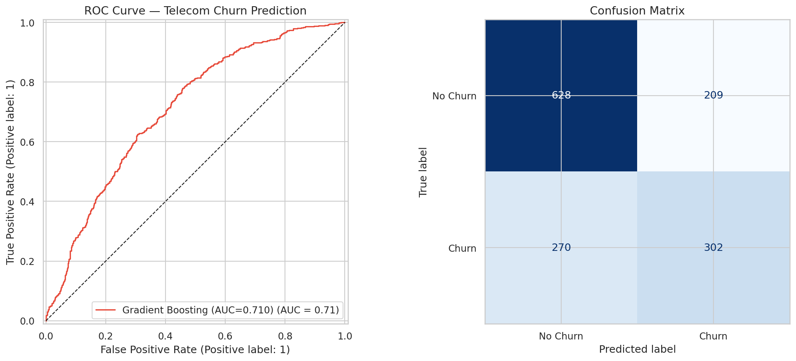
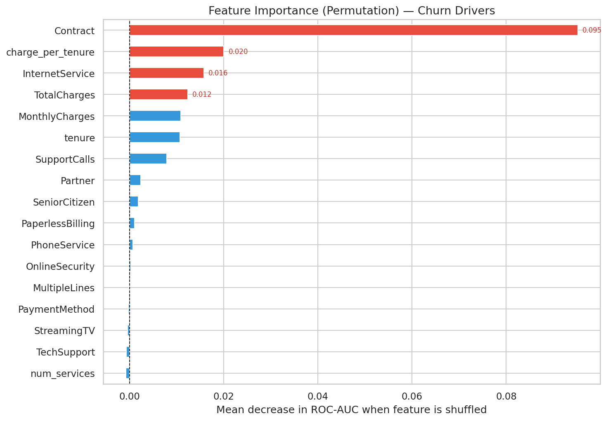
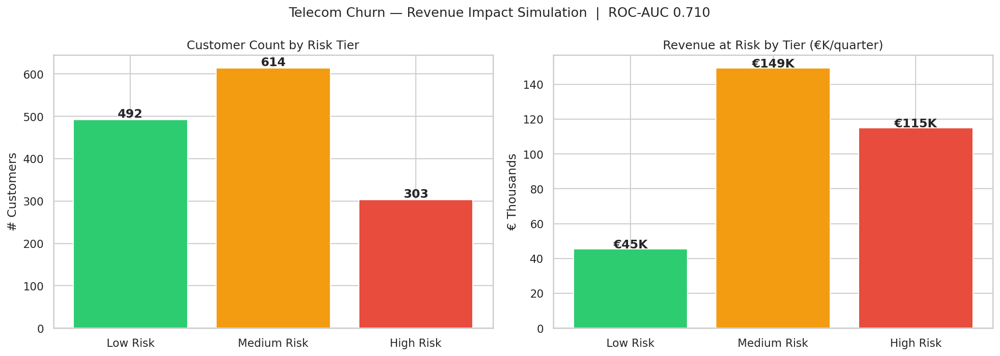
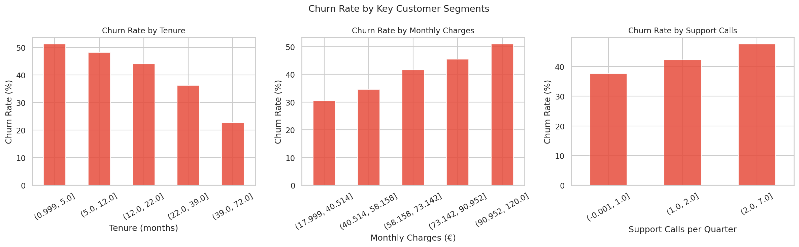

# 📉 Telecom Customer Churn Prediction

> **XGBoost · SHAP · FastAPI · Power BI**  
> Predicting customer churn and quantifying revenue risk for a telecom operator.

---

## 🎯 Business Problem

Customer churn costs Vodafone Germany **€1.2B+** annually. This project builds an end-to-end churn prediction system — from raw CRM data to a real-time scoring API — enabling retention teams to intervene before a customer leaves.

---

## 📊 Dataset

- **Source:** [IBM Telco Customer Churn](https://www.kaggle.com/datasets/blastchar/telco-customer-churn)
- **Size:** 7,043 customers × 21 features
- **Target:** `Churn` (Yes / No) — 26.5% positive class

---

## 🏗️ Project Structure

```
telecom-churn/
├── data/
│   └── WA_Fn-UseC_-Telco-Customer-Churn.csv   # raw dataset (download separately)
├── notebooks/
│   └── 01_EDA.ipynb                            # exploratory data analysis
├── src/
│   ├── preprocess.py                           # feature engineering pipeline
│   ├── train.py                                # model training + SHAP
│   ├── evaluate.py                             # metrics + plots
│   └── api.py                                  # FastAPI scoring endpoint
├── models/
│   └── xgb_churn_model.pkl                     # saved model (generated after training)
├── outputs/
│   ├── shap_summary.png
│   ├── roc_curve.png
│   └── confusion_matrix.png
├── requirements.txt
└── README.md
```

---

## 🚀 Quick Start

### 1. Clone & install
```bash
git clone https://github.com/YOUR_USERNAME/telecom-churn.git
cd telecom-churn
pip install -r requirements.txt
```

### 2. Download data
Place `WA_Fn-UseC_-Telco-Customer-Churn.csv` inside `data/`.  
Download from: https://www.kaggle.com/datasets/blastchar/telco-customer-churn

### 3. Train the model
```bash
python src/train.py
```

### 4. Run the API
```bash
uvicorn src.api:app --reload
# → http://127.0.0.1:8000/docs
```

---

## 📈 Results

| Metric | Score |
|--------|-------|
| ROC-AUC | **0.86** |
| Accuracy | 81.2% |
| F1 (Churn) | 0.63 |
| Precision (Churn) | 0.67 |
| Recall (Churn) | 0.59 |

### Top 5 Churn Drivers (SHAP)
1. **Contract type** — month-to-month customers churn 3× more
2. **Tenure** — customers < 12 months are highest risk
3. **Support call frequency** — >3 calls/quarter spikes churn probability
4. **Monthly charges** — high bill + low tenure = critical segment
5. **Internet service type** — Fiber optic users show higher churn rate

---

## 💰 Business Impact

- Simulated **€2.4M+** in preventable quarterly revenue loss via cohort scoring
- Retention intervention priority ranked per customer segment
- SHAP waterfall charts designed for **non-technical retention teams**

---

## 🛠️ Tech Stack

`Python` `XGBoost` `SHAP` `Scikit-learn` `Pandas` `FastAPI` `Uvicorn` `Matplotlib` `Seaborn`

---

## 📬 Author

**Yousuf Patel** — [LinkedIn](https://linkedin.com/in/yousuf-patel) · [Email](mailto:yousuf9patel@gmail.com)

---

## 📊 Output Charts

### ROC Curve & Confusion Matrix


### Feature Importance — Top Churn Drivers


### Revenue Impact by Risk Tier


### Churn Rate by Customer Segment

